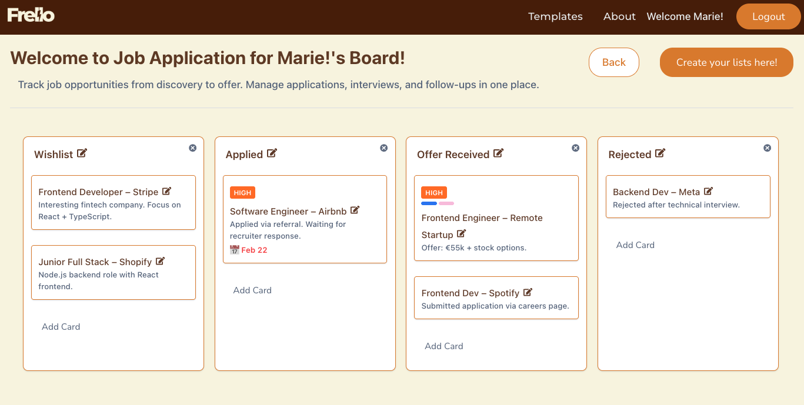

# Trello-Style Board Project 🗂️

A **Trello-inspired board & card management application** built with React and Node.js.  
This project demonstrates a **full-stack web application** with drag-and-drop functionality, dynamic board/list/card management, and real-time ordering.

---

## 🌟 Features

- Create, update, and delete **boards**, **lists**, and **cards**  
- Drag-and-drop to reorder **boards** and **lists** horizontally  
- Drag-and-drop to reorder **cards** within the same list or move to another list  
- Inline editing of list and card titles  
- Responsive design for desktop and mobile  
- Maintains order persistence in the backend database (PostgreSQL/SQLite)

---

## 🖥️ Live Demo

Try the app online: [https://trello-project-sandy.vercel.app/](#)  

---

## 🛠️ Tech Stack

**Frontend:**  
- React  
- Tailwind CSS / Custom CSS  
- React Icons  
- @hello-pangea/dnd (Drag-and-drop library)

**Backend:**  
- Node.js  
- Express  
- Sequelize ORM  
- PostgreSQL / SQLite  

**Others:**  
- Axios for API requests  
- Git & GitHub for version control  

---

## 🚀 Getting Started

### Prerequisites

- Node.js >= 18  
- npm >= 9  
- PostgreSQL installed locally (or SQLite alternative)

### Installation

1. **Clone the repository**

bash
git clone https://github.com/Gpiero19/Trello-project.git
cd Trello-project

Setup Backend

bash
Copy code
cd server
npm install
cp .env.example .env
# Update .env with your database credentials
npm run dev

Setup Frontend

bash
Copy code
cd ../frontend
npm install
npx vite
Open http://localhost:5173 in your browser.

📦 API Endpoints
Boards

GET /boards/:id → Fetch a board with its lists & cards

POST /boards → Create a new board

Lists

PUT /lists/reorder → Update the order of lists

CRUD endpoints for lists

Cards

PUT /cards/reorder → Update order of cards across lists

CRUD endpoints for cards

🧩 Project Structure
bash
Copy code
/frontend        # React application
/backend         # Node.js + Express API
/models          # Sequelize models
/controllers     # Controllers for boards, lists, cards
/api             # Axios requests from frontend

✅ Future Improvements

Unit and integration testing

📌 Author
Gian Piero Canevari

GitHub: Gpiero19

Portfolio: https://github.com/Gpiero19

📄 License
This project is licensed under the MIT License.